# Academy Manager - Architecture Specification

> **Version**: 1.0 (SRS_FINAL 기반)
> **Last Updated**: 2026-02-02

---

## 1. 개발 전략: Backend First

### Phase A: Backend (API Routes)
```
Step 1: Storage & Types
        ├── 엔티티 13개 타입 정의
        ├── Enum 타입 정의
        ├── 상수 정의 (PAGE_SIZE, PAYMENT_METHODS 등)
        └── lib/storage.ts (JSON read/write)

Step 2: Settings API + Master Data
        └── 학원 설정, 등급, 과목, 교실, 등록경로 관리

Step 3: Student API (5개)
        └── 수강생 CRUD + 상세 조회

Step 4: Instructor API (4개) + InstructorSalary API (4개)
        └── 강사 CRUD + 급여 관리

Step 5: Class API (5개) + Enrollment API (4개)
        └── 반 CRUD + 수강 등록/취소/충돌검사

Step 6: Attendance API (4개) + MakeupClass API (3개)
        └── 출석 체크 + 보강 예약

Step 7: Payment API (6개) + Refund API (2개)
        └── 수납 관리 + 일할계산 + 환불

Step 8: Consultation API (3개) + Holiday API (4개)
        └── 상담 기록 + 휴일 관리

Step 9: Waitlist API (4개)
        └── 대기자 관리

Step 10: Dashboard & Schedule API (5개) + Search & Export API (4개)
         └── 대시보드, 시간표, 통합검색, Excel 내보내기

Step 11: Backup API (2개)
         └── 데이터 백업/복원

Step 12: curl 전체 테스트 (59개 API)
```

### Phase B: Frontend
```
Step 13: Layout & Navigation (통합 검색 포함)
Step 14: Common Components
Step 15: Settings & Master Data Pages
Step 16: Instructor & Student Pages
Step 17: Class & Enrollment Pages (대기자 포함)
Step 18: Attendance & MakeupClass Pages
Step 19: Payment & Refund Pages
Step 20: InstructorSalary Pages
Step 21: Consultation & Dashboard Pages (리마인더 포함)
Step 22: Schedule View (주간 + 월간)
Step 23: Holiday Management
Step 24: Export Features
Step 25: Polish & Testing
```

---

## 2. System Architecture Diagram

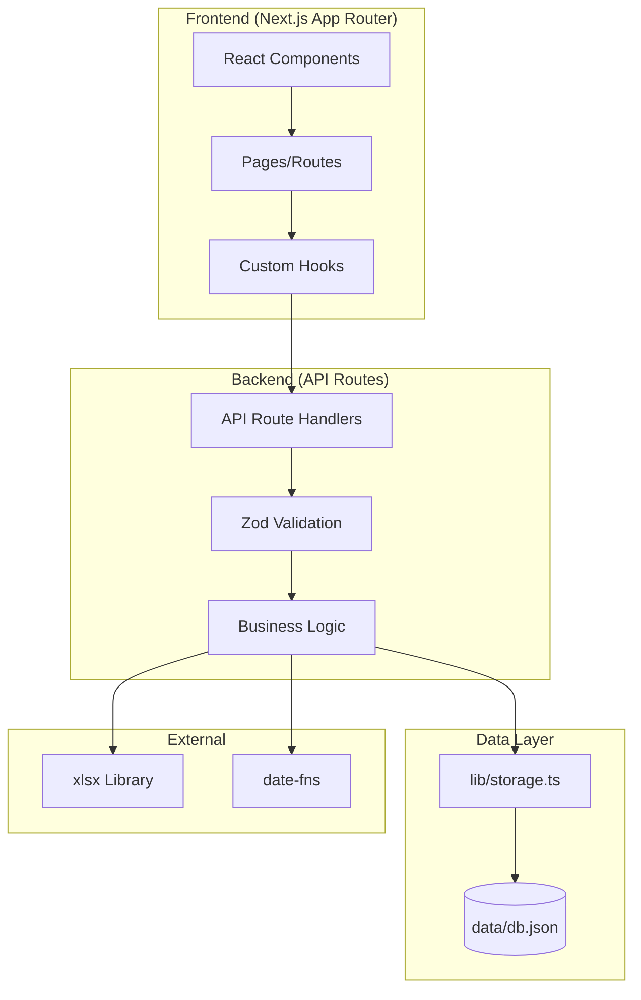

---

## 3. Entity Relationship Diagram (ERD)

```mermaid
erDiagram
    Settings ||--o{ Level : contains
    Settings ||--o{ Subject : contains
    Settings ||--o{ Room : contains
    Settings ||--o{ Source : contains

    Student ||--o{ Enrollment : has
    Student ||--o{ Payment : has
    Student ||--o{ Consultation : has
    Student ||--o{ Waitlist : has
    Student }o--|| Level : belongs_to
    Student }o--|| Source : registered_via

    Instructor ||--o{ Class : teaches
    Instructor ||--o{ InstructorSalary : receives
    Instructor }o--o{ Subject : teaches

    Class ||--o{ Enrollment : has
    Class ||--o{ Attendance : has
    Class ||--o{ Payment : for
    Class ||--o{ Waitlist : has
    Class ||--o{ MakeupClass : has
    Class }o--|| Subject : belongs_to
    Class }o--|| Room : uses
    Class }o--|| Instructor : taught_by

    Enrollment ||--o{ MakeupClass : generates
    Enrollment ||--o{ Attendance : generates

    Payment ||--o{ Refund : has

    Holiday ||--|| Attendance : blocks

    Student {
        string id PK
        string name
        string phone
        string parentPhone
        string email
        string birthDate
        string levelId FK
        string sourceId FK
        string status
        string enrollDate
        string notes
        string createdAt
    }

    Instructor {
        string id PK
        string name
        string phone
        string email
        array subjectIds FK
        number monthlySalary
        string status
        string color
        string notes
        string createdAt
    }

    Class {
        string id PK
        string name
        string subjectId FK
        string instructorId FK
        number maxStudents
        array schedule
        number monthlyFee
        string status
        string roomId FK
        string notes
        string createdAt
    }

    Enrollment {
        string id PK
        string studentId FK
        string classId FK
        string enrollDate
        string status
        string droppedDate
    }

    Attendance {
        string id PK
        string classId FK
        string studentId FK
        string date
        string status
        string notes
    }

    Payment {
        string id PK
        string studentId FK
        string classId FK
        number amount
        number paidAmount
        string month
        string status
        string paidDate
        string method
        boolean isProrated
        string notes
        string createdAt
    }

    Consultation {
        string id PK
        string studentId FK
        string date
        string type
        string content
        string nextAction
        string nextActionDate
        string createdAt
    }

    MakeupClass {
        string id PK
        string enrollmentId FK
        string absenceDate
        string scheduledDate
        string scheduledTime
        string status
        string createdAt
    }

    Waitlist {
        string id PK
        string studentId FK
        string classId FK
        string registeredAt
        number priority
        string status
        string enrolledAt
    }

    InstructorSalary {
        string id PK
        string instructorId FK
        string month
        number amount
        string status
        string paidDate
        string notes
        string createdAt
    }

    Holiday {
        string id PK
        string date
        string name
        string type
        string createdAt
    }

    Refund {
        string id PK
        string paymentId FK
        number amount
        string reason
        string refundDate
        string createdAt
    }
```

---

## 4. API Routes (59개)

### 4.1 Student API (5개)

#### GET /api/students
수강생 목록 조회 (검색, 상태필터, 페이지네이션)
```typescript
// Request Query
{
  search?: string;        // 이름, 연락처 검색
  status?: StudentStatus; // active | inactive | withdrawn
  levelId?: string;       // 등급 필터
  page?: number;          // 기본값: 1
  limit?: number;         // 기본값: 10
}

// Response
{
  data: Student[];
  pagination: {
    page: number;
    limit: number;
    total: number;
    totalPages: number;
  };
}
```

#### POST /api/students
수강생 등록
```typescript
// Request Body
{
  name: string;           // 필수
  phone: string;          // 필수
  parentPhone?: string;
  email?: string;
  birthDate?: string;     // YYYY-MM-DD
  levelId?: string;
  sourceId?: string;
  notes?: string;
}

// Response
{
  data: Student;
  message: "수강생이 등록되었습니다.";
}
```

#### GET /api/students/[id]
수강생 상세 조회 (수강 반, 출석률, 수납내역 포함)
```typescript
// Response
{
  data: {
    student: Student;
    enrollments: {
      enrollment: Enrollment;
      class: Class;
      attendanceRate: number;
    }[];
    payments: Payment[];
    consultations: Consultation[];
    waitlists: Waitlist[];
  };
}
```

#### PUT /api/students/[id]
수강생 정보 수정
```typescript
// Request Body
{
  name?: string;
  phone?: string;
  parentPhone?: string;
  email?: string;
  birthDate?: string;
  levelId?: string;
  sourceId?: string;
  status?: StudentStatus;
  notes?: string;
}

// Response
{
  data: Student;
  message: "수강생 정보가 수정되었습니다.";
}
```

#### DELETE /api/students/[id]
수강생 삭제
```typescript
// Response (Success)
{
  message: "수강생이 삭제되었습니다.";
}

// Response (Error - active enrollment exists)
{
  error: "활성 수강 중인 반이 있어 삭제할 수 없습니다.";
  code: "ACTIVE_ENROLLMENT_EXISTS";
}
```

---

### 4.2 Instructor API (4개)

#### GET /api/instructors
강사 목록 조회
```typescript
// Request Query
{
  status?: InstructorStatus;
  subjectId?: string;
  page?: number;
  limit?: number;
}

// Response
{
  data: {
    instructor: Instructor;
    classCount: number;      // 담당 반 수
    studentCount: number;    // 담당 수강생 수
  }[];
  pagination: Pagination;
}
```

#### POST /api/instructors
강사 등록
```typescript
// Request Body
{
  name: string;           // 필수
  phone: string;          // 필수
  email?: string;
  subjectIds: string[];   // 필수, 최소 1개
  monthlySalary?: number;
  color?: string;         // hex color
  notes?: string;
}

// Response
{
  data: Instructor;
  message: "강사가 등록되었습니다.";
}
```

#### PUT /api/instructors/[id]
강사 정보 수정
```typescript
// Request Body
{
  name?: string;
  phone?: string;
  email?: string;
  subjectIds?: string[];
  monthlySalary?: number;
  status?: InstructorStatus;
  color?: string;
  notes?: string;
}

// Response
{
  data: Instructor;
  message: "강사 정보가 수정되었습니다.";
}
```

#### DELETE /api/instructors/[id]
강사 삭제
```typescript
// Response (Error - has active classes)
{
  error: "담당 중인 반이 있어 삭제할 수 없습니다.";
  code: "ACTIVE_CLASS_EXISTS";
}
```

---

### 4.3 Class API (5개)

#### GET /api/classes
반 목록 조회
```typescript
// Request Query
{
  status?: ClassStatus;
  subjectId?: string;
  instructorId?: string;
  page?: number;
  limit?: number;
}

// Response
{
  data: {
    class: Class;
    instructor: Instructor;
    subject: Subject;
    room?: Room;
    currentStudents: number;
    waitlistCount: number;
  }[];
  pagination: Pagination;
}
```

#### POST /api/classes
반 생성 (시간표 충돌 검증)
```typescript
// Request Body
{
  name: string;           // 필수
  subjectId: string;      // 필수
  instructorId: string;   // 필수
  maxStudents: number;    // 필수
  schedule: {
    dayOfWeek: number;    // 0-6
    startTime: string;    // HH:MM
    endTime: string;      // HH:MM
  }[];                    // 필수, 최소 1개
  monthlyFee: number;     // 필수
  roomId?: string;
  notes?: string;
}

// Response (Error - schedule conflict)
{
  error: "시간표 충돌이 발생했습니다.";
  code: "SCHEDULE_CONFLICT";
  conflicts: {
    type: "instructor" | "room";
    existingClass: string;
    dayOfWeek: number;
    time: string;
  }[];
}
```

#### GET /api/classes/[id]
반 상세 조회
```typescript
// Response
{
  data: {
    class: Class;
    instructor: Instructor;
    subject: Subject;
    room?: Room;
    enrollments: {
      enrollment: Enrollment;
      student: Student;
      attendanceRate: number;
      paymentStatus: PaymentStatus;
    }[];
    waitlist: {
      waitlist: Waitlist;
      student: Student;
    }[];
    recentAttendance: Attendance[];
  };
}
```

#### PUT /api/classes/[id]
반 수정 (시간표 충돌 재검증)
```typescript
// Request Body
{
  name?: string;
  subjectId?: string;
  instructorId?: string;
  maxStudents?: number;
  schedule?: Schedule[];
  monthlyFee?: number;
  status?: ClassStatus;
  roomId?: string;
  notes?: string;
}

// Response
{
  data: Class;
  message: "반 정보가 수정되었습니다.";
}
```

#### DELETE /api/classes/[id]
반 삭제
```typescript
// Response (Error - has active enrollments)
{
  error: "수강 중인 학생이 있어 삭제할 수 없습니다.";
  code: "ACTIVE_ENROLLMENT_EXISTS";
}
```

---

### 4.4 Enrollment API (4개)

#### GET /api/enrollments
수강 현황 목록
```typescript
// Request Query
{
  classId?: string;
  studentId?: string;
  status?: EnrollmentStatus;
  page?: number;
  limit?: number;
}

// Response
{
  data: {
    enrollment: Enrollment;
    student: Student;
    class: Class;
  }[];
  pagination: Pagination;
}
```

#### POST /api/enrollments
수강 등록 (정원 확인, 충돌 검사)
```typescript
// Request Body
{
  studentId: string;      // 필수
  classId: string;        // 필수
}

// Response (Success)
{
  data: Enrollment;
  message: "수강 등록이 완료되었습니다.";
}

// Response (Error - class full, auto waitlist)
{
  error: "정원이 초과되어 대기자로 등록되었습니다.";
  code: "CLASS_FULL_WAITLISTED";
  data: Waitlist;
}

// Response (Warning - schedule conflict)
{
  data: Enrollment;
  message: "수강 등록이 완료되었습니다.";
  warning: "기존 수강 반과 시간표가 충돌합니다.";
  conflicts: {
    classId: string;
    className: string;
    dayOfWeek: number;
    time: string;
  }[];
}
```

#### PATCH /api/enrollments/[id]/drop
수강 취소
```typescript
// Response
{
  data: Enrollment;
  message: "수강이 취소되었습니다.";
}
```

#### POST /api/enrollments/check-conflict
시간표 충돌 검사
```typescript
// Request Body
{
  studentId: string;
  classId: string;
}

// Response
{
  hasConflict: boolean;
  conflicts: {
    classId: string;
    className: string;
    dayOfWeek: number;
    time: string;
  }[];
}
```

---

### 4.5 Attendance API (4개)

#### GET /api/attendance
출석 목록 조회
```typescript
// Request Query
{
  classId: string;        // 필수
  date?: string;          // YYYY-MM-DD
  startDate?: string;
  endDate?: string;
  studentId?: string;
}

// Response
{
  data: {
    attendance: Attendance;
    student: Student;
  }[];
  isHoliday: boolean;     // 해당 날짜가 휴일인 경우
  holidayName?: string;
}
```

#### POST /api/attendance/bulk
일괄 출석 체크
```typescript
// Request Body
{
  classId: string;        // 필수
  date: string;           // 필수, YYYY-MM-DD
  records: {
    studentId: string;
    status: AttendanceStatus;
    notes?: string;
  }[];
}

// Response (Error - holiday)
{
  error: "휴일에는 출석 체크를 할 수 없습니다.";
  code: "HOLIDAY_NOT_ALLOWED";
  holiday: Holiday;
}

// Response (Success)
{
  data: Attendance[];
  message: "출석이 저장되었습니다.";
}
```

#### PUT /api/attendance/[id]
출석 상태 수정
```typescript
// Request Body
{
  status: AttendanceStatus;
  notes?: string;
}

// Response
{
  data: Attendance;
  message: "출석 상태가 수정되었습니다.";
}
```

#### GET /api/attendance/stats
출석 통계
```typescript
// Request Query
{
  classId?: string;
  studentId?: string;
  startDate?: string;
  endDate?: string;
}

// Response
{
  data: {
    studentId: string;
    studentName: string;
    classId: string;
    className: string;
    totalDays: number;
    presentDays: number;
    absentDays: number;
    lateDays: number;
    excusedDays: number;
    attendanceRate: number;
  }[];
}
```

---

### 4.6 Payment API (6개)

#### GET /api/payments
수납 목록 조회
```typescript
// Request Query
{
  month?: string;         // YYYY-MM
  status?: PaymentStatus;
  studentId?: string;
  classId?: string;
  page?: number;
  limit?: number;
}

// Response
{
  data: {
    payment: Payment;
    student: Student;
    class: Class;
    refunds: Refund[];
  }[];
  pagination: Pagination;
  summary: {
    totalAmount: number;
    paidAmount: number;
    unpaidAmount: number;
  };
}
```

#### POST /api/payments
수납 등록 (일할계산 지원)
```typescript
// Request Body
{
  studentId: string;      // 필수
  classId: string;        // 필수
  amount: number;         // 필수
  month: string;          // 필수, YYYY-MM
  isProrated?: boolean;   // 일할계산 여부
  notes?: string;
}

// Response (Error - student inactive)
{
  error: "일시중단 상태의 수강생은 수납 등록이 불가합니다.";
  code: "STUDENT_INACTIVE";
}

// Response (Error - duplicate)
{
  error: "이미 해당 월의 수납 건이 존재합니다.";
  code: "DUPLICATE_PAYMENT";
}
```

#### GET /api/payments/[id]
수납 상세 조회
```typescript
// Response
{
  data: {
    payment: Payment;
    student: Student;
    class: Class;
    refunds: Refund[];
  };
}
```

#### PATCH /api/payments/[id]/pay
납부 처리 (전액/반액 선택)
```typescript
// Request Body
{
  paymentType: "full" | "half";  // 필수
  method: PaymentMethod;         // 필수
}

// Response
{
  data: Payment;
  message: "납부 처리가 완료되었습니다.";
}
```

#### GET /api/payments/unpaid
미납 목록
```typescript
// Request Query
{
  includeOverdue?: boolean;  // 연체 포함 여부
}

// Response
{
  data: {
    payment: Payment;
    student: Student;
    class: Class;
    daysOverdue?: number;
  }[];
  summary: {
    unpaidCount: number;
    unpaidAmount: number;
    overdueCount: number;
    overdueAmount: number;
  };
}
```

#### POST /api/payments/calculate-prorated
일할 계산
```typescript
// Request Body
{
  classId: string;        // 필수
  enrollDate: string;     // 필수, YYYY-MM-DD
  month: string;          // 필수, YYYY-MM
}

// Response
{
  originalAmount: number;
  proratedAmount: number;
  totalClassDays: number;
  remainingDays: number;
  calculationDetails: string;
}
```

---

### 4.7 Refund API (2개)

#### GET /api/refunds
환불 목록
```typescript
// Request Query
{
  studentId?: string;
  startDate?: string;
  endDate?: string;
  page?: number;
  limit?: number;
}

// Response
{
  data: {
    refund: Refund;
    payment: Payment;
    student: Student;
    class: Class;
  }[];
  pagination: Pagination;
}
```

#### POST /api/refunds
환불 처리
```typescript
// Request Body
{
  paymentId: string;      // 필수
  amount: number;         // 필수
  reason: string;         // 필수
}

// Response (Error - invalid payment status)
{
  error: "납부되지 않은 건은 환불할 수 없습니다.";
  code: "INVALID_PAYMENT_STATUS";
}

// Response (Error - amount exceeds)
{
  error: "환불 금액이 납부 금액을 초과합니다.";
  code: "REFUND_AMOUNT_EXCEEDS";
}

// Response (Success)
{
  data: Refund;
  message: "환불이 처리되었습니다.";
}
```

---

### 4.8 Consultation API (3개)

#### GET /api/consultations
상담 기록 목록
```typescript
// Request Query
{
  studentId?: string;
  type?: ConsultationType;
  startDate?: string;
  endDate?: string;
  hasNextAction?: boolean;  // 후속 조치 있는 것만
  page?: number;
  limit?: number;
}

// Response
{
  data: {
    consultation: Consultation;
    student: Student;
  }[];
  pagination: Pagination;
}
```

#### POST /api/consultations
상담 기록 등록
```typescript
// Request Body
{
  studentId: string;      // 필수
  date: string;           // 필수, YYYY-MM-DD
  type: ConsultationType; // 필수
  content: string;        // 필수
  nextAction?: string;
  nextActionDate?: string; // YYYY-MM-DD
}

// Response
{
  data: Consultation;
  message: "상담 기록이 등록되었습니다.";
}
```

#### DELETE /api/consultations/[id]
상담 기록 삭제
```typescript
// Response
{
  message: "상담 기록이 삭제되었습니다.";
}
```

---

### 4.9 MakeupClass API (3개)

#### GET /api/makeup-classes
보강 목록
```typescript
// Request Query
{
  enrollmentId?: string;
  classId?: string;
  studentId?: string;
  status?: MakeupStatus;
  startDate?: string;
  endDate?: string;
}

// Response
{
  data: {
    makeupClass: MakeupClass;
    enrollment: Enrollment;
    student: Student;
    class: Class;
  }[];
}
```

#### POST /api/makeup-classes
보강 예약
```typescript
// Request Body
{
  enrollmentId: string;   // 필수
  absenceDate: string;    // 필수, YYYY-MM-DD (결석 기록 있어야 함)
  scheduledDate: string;  // 필수, YYYY-MM-DD
  scheduledTime: string;  // 필수, HH:MM
}

// Response (Error - no absence record)
{
  error: "해당 날짜에 결석 기록이 없습니다.";
  code: "NO_ABSENCE_RECORD";
}

// Response (Error - holiday)
{
  error: "휴일에는 보강을 예약할 수 없습니다.";
  code: "HOLIDAY_NOT_ALLOWED";
}

// Response (Success)
{
  data: MakeupClass;
  message: "보강이 예약되었습니다.";
}
```

#### PATCH /api/makeup-classes/[id]
보강 상태 변경
```typescript
// Request Body
{
  status: "completed" | "cancelled";
}

// Response
{
  data: MakeupClass;
  message: "보강 상태가 변경되었습니다.";
}
```

---

### 4.10 Waitlist API (4개)

#### GET /api/waitlist
대기자 목록
```typescript
// Request Query
{
  classId?: string;
  studentId?: string;
  status?: WaitlistStatus;
}

// Response
{
  data: {
    waitlist: Waitlist;
    student: Student;
    class: Class;
  }[];
}
```

#### POST /api/waitlist
대기 등록
```typescript
// Request Body
{
  studentId: string;      // 필수
  classId: string;        // 필수
}

// Response (Error - duplicate)
{
  error: "이미 대기 등록되어 있습니다.";
  code: "DUPLICATE_WAITLIST";
}

// Response (Success)
{
  data: Waitlist;
  message: "대기 등록이 완료되었습니다.";
  position: number;       // 대기 순번
}
```

#### PATCH /api/waitlist/[id]/enroll
대기자 수강 전환
```typescript
// Response (Error - still full)
{
  error: "아직 정원에 여유가 없습니다.";
  code: "CLASS_STILL_FULL";
}

// Response (Success)
{
  data: {
    waitlist: Waitlist;
    enrollment: Enrollment;
  };
  message: "수강 전환이 완료되었습니다.";
}
```

#### DELETE /api/waitlist/[id]
대기 취소
```typescript
// Response
{
  message: "대기가 취소되었습니다.";
}
```

---

### 4.11 InstructorSalary API (4개)

#### GET /api/instructor-salaries
급여 목록
```typescript
// Request Query
{
  instructorId?: string;
  month?: string;         // YYYY-MM
  status?: SalaryStatus;
  page?: number;
  limit?: number;
}

// Response
{
  data: {
    salary: InstructorSalary;
    instructor: Instructor;
  }[];
  pagination: Pagination;
  summary: {
    totalAmount: number;
    paidAmount: number;
    unpaidAmount: number;
  };
}
```

#### POST /api/instructor-salaries
급여 등록
```typescript
// Request Body
{
  instructorId: string;   // 필수
  month: string;          // 필수, YYYY-MM
  amount: number;         // 필수
  notes?: string;
}

// Response (Error - duplicate)
{
  error: "이미 해당 월의 급여가 등록되어 있습니다.";
  code: "DUPLICATE_SALARY";
}

// Response (Success)
{
  data: InstructorSalary;
  message: "급여가 등록되었습니다.";
}
```

#### PATCH /api/instructor-salaries/[id]/pay
급여 지급 처리
```typescript
// Response
{
  data: InstructorSalary;
  message: "급여가 지급 처리되었습니다.";
}
```

#### GET /api/instructor-salaries/stats
급여 통계
```typescript
// Request Query
{
  year?: number;
}

// Response
{
  data: {
    month: string;
    totalAmount: number;
    paidAmount: number;
    unpaidAmount: number;
    instructorCount: number;
  }[];
  yearTotal: {
    totalAmount: number;
    paidAmount: number;
  };
}
```

---

### 4.12 Holiday API (4개)

#### GET /api/holidays
휴일 목록
```typescript
// Request Query
{
  year?: number;
  type?: HolidayType;
}

// Response
{
  data: Holiday[];
}
```

#### POST /api/holidays
휴일 등록
```typescript
// Request Body
{
  date: string;           // 필수, YYYY-MM-DD
  name: string;           // 필수
  type: HolidayType;      // 필수
}

// Response (Error - duplicate)
{
  error: "이미 등록된 휴일입니다.";
  code: "DUPLICATE_HOLIDAY";
}

// Response (Success)
{
  data: Holiday;
  message: "휴일이 등록되었습니다.";
}
```

#### DELETE /api/holidays/[id]
휴일 삭제
```typescript
// Response
{
  message: "휴일이 삭제되었습니다.";
}
```

#### POST /api/holidays/init-public
공휴일 자동 등록
```typescript
// Request Body
{
  year: number;           // 필수
}

// Response
{
  data: Holiday[];
  message: "공휴일이 등록되었습니다.";
  count: number;
}
```

---

### 4.13 Dashboard & Schedule API (5개)

#### GET /api/dashboard
대시보드 통계
```typescript
// Response
{
  data: {
    totalStudents: number;
    totalClasses: number;
    totalInstructors: number;
    monthlyRevenue: number;
    unpaidCount: number;
    unpaidAmount: number;
    unpaidList: {
      student: Student;
      class: Class;
      amount: number;
      month: string;
    }[];
    averageAttendanceRate: number;
    recentConsultations: {
      consultation: Consultation;
      student: Student;
    }[];
    todaySchedule: {
      class: Class;
      instructor: Instructor;
      startTime: string;
      endTime: string;
    }[];
    todayReminders: {
      consultation: Consultation;
      student: Student;
    }[];
    enrollmentTrend: {
      month: string;
      count: number;
    }[];
    waitlistCount: number;
  };
}
```

#### GET /api/schedule/weekly
주간 시간표
```typescript
// Request Query
{
  date?: string;          // 기준 날짜 (해당 주)
  instructorId?: string;
  roomId?: string;
}

// Response
{
  data: {
    dayOfWeek: number;
    classes: {
      class: Class;
      instructor: Instructor;
      room?: Room;
      startTime: string;
      endTime: string;
    }[];
  }[];
  weekRange: {
    start: string;
    end: string;
  };
}
```

#### GET /api/schedule/monthly
월간 시간표
```typescript
// Request Query
{
  year: number;
  month: number;
  instructorId?: string;
  roomId?: string;
}

// Response
{
  data: {
    date: string;
    dayOfWeek: number;
    isHoliday: boolean;
    holidayName?: string;
    classes: {
      class: Class;
      instructor: Instructor;
      startTime: string;
      endTime: string;
    }[];
  }[];
}
```

#### GET /api/settings
학원 설정 조회
```typescript
// Response
{
  data: Settings;
}
```

#### PUT /api/settings
학원 설정 수정
```typescript
// Request Body
{
  academyName?: string;
  phone?: string;
  address?: string;
  operatingHours?: {
    start: string;
    end: string;
  };
  levels?: Level[];
  subjects?: Subject[];
  rooms?: Room[];
  sources?: Source[];
}

// Response
{
  data: Settings;
  message: "설정이 저장되었습니다.";
}
```

---

### 4.14 Search & Export API (4개)

#### GET /api/search
통합 검색
```typescript
// Request Query
{
  q: string;              // 필수, 검색어
  type?: "all" | "student" | "class" | "instructor";
  limit?: number;         // 각 타입별 최대 결과 수
}

// Response
{
  data: {
    students: Student[];
    classes: Class[];
    instructors: Instructor[];
  };
  totalCount: number;
}
```

#### GET /api/export/students
수강생 Excel 내보내기
```typescript
// Request Query
{
  status?: StudentStatus;
  levelId?: string;
}

// Response
// Content-Type: application/vnd.openxmlformats-officedocument.spreadsheetml.sheet
// Content-Disposition: attachment; filename="students_YYYYMMDD.xlsx"
```

#### GET /api/export/payments
수납 Excel 내보내기
```typescript
// Request Query
{
  month?: string;
  status?: PaymentStatus;
}

// Response
// Content-Type: application/vnd.openxmlformats-officedocument.spreadsheetml.sheet
// Content-Disposition: attachment; filename="payments_YYYYMMDD.xlsx"
```

#### GET /api/export/attendance
출석 Excel 내보내기
```typescript
// Request Query
{
  classId?: string;
  startDate?: string;
  endDate?: string;
}

// Response
// Content-Type: application/vnd.openxmlformats-officedocument.spreadsheetml.sheet
// Content-Disposition: attachment; filename="attendance_YYYYMMDD.xlsx"
```

---

### 4.15 Backup API (2개)

#### GET /api/backup
데이터 백업
```typescript
// Response
// Content-Type: application/json
// Content-Disposition: attachment; filename="backup_YYYYMMDD_HHMMSS.json"
{
  version: string;
  exportedAt: string;
  data: Database;
}
```

#### POST /api/backup
데이터 복원
```typescript
// Request Body
{
  version: string;
  exportedAt: string;
  data: Database;
}

// Response
{
  message: "데이터가 복원되었습니다.";
  stats: {
    students: number;
    instructors: number;
    classes: number;
    // ... 각 엔티티별 복원 건수
  };
}
```

---

## 5. Storage 구조

### 5.1 Database Interface
```typescript
interface Database {
  // 기본 엔티티
  students: Student[];
  instructors: Instructor[];
  classes: Class[];
  enrollments: Enrollment[];
  attendances: Attendance[];
  payments: Payment[];
  consultations: Consultation[];

  // 신규 엔티티
  makeupClasses: MakeupClass[];
  waitlists: Waitlist[];
  instructorSalaries: InstructorSalary[];
  holidays: Holiday[];
  refunds: Refund[];

  // 설정
  settings: Settings;
}
```

### 5.2 lib/storage.ts Functions
```typescript
// Database I/O
function readDatabase(): Database;
function writeDatabase(db: Database): void;

// Generic CRUD helpers
function generateId(): string;
function findById<T>(items: T[], id: string): T | undefined;
function findByIds<T>(items: T[], ids: string[]): T[];

// Date utilities
function getCurrentDate(): string;  // YYYY-MM-DD
function getCurrentDateTime(): string;  // ISO string
function isHoliday(date: string, holidays: Holiday[]): boolean;

// Business logic helpers
function calculateProratedAmount(
  monthlyFee: number,
  enrollDate: string,
  month: string,
  schedule: Schedule[]
): number;

function checkScheduleConflict(
  schedule: Schedule[],
  existingClasses: Class[],
  instructorId?: string,
  roomId?: string,
  excludeClassId?: string
): ConflictResult[];

function checkStudentScheduleConflict(
  studentId: string,
  newClassSchedule: Schedule[],
  enrollments: Enrollment[],
  classes: Class[],
  excludeClassId?: string
): ConflictResult[];
```

---

## 6. 데이터 흐름

### 6.1 수강 등록 흐름
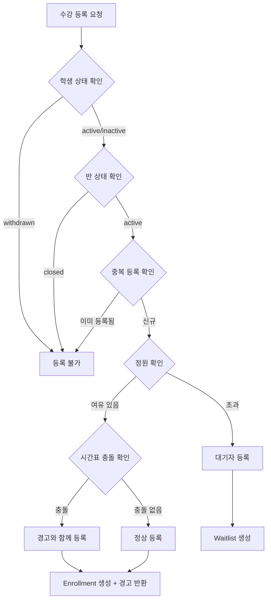

### 6.2 수납 처리 흐름
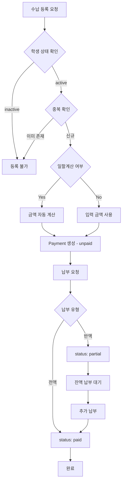

### 6.3 출석 체크 흐름
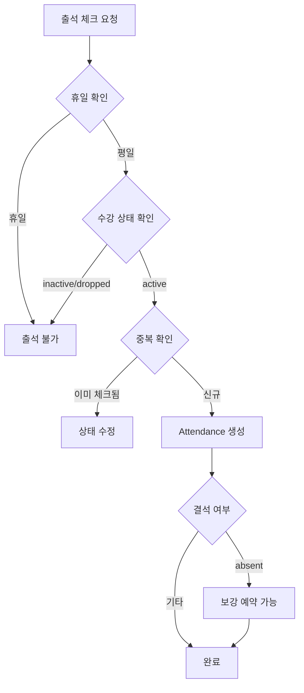

### 6.4 보강 예약 흐름
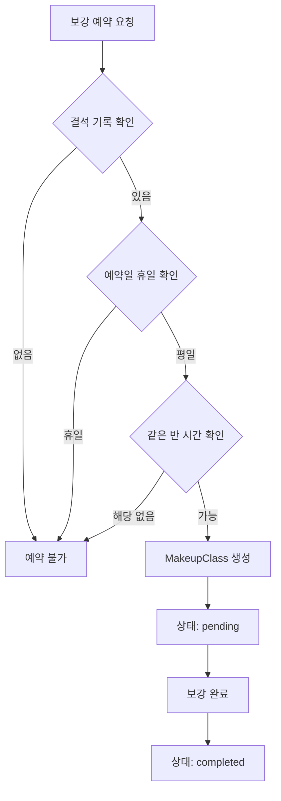

### 6.5 환불 처리 흐름
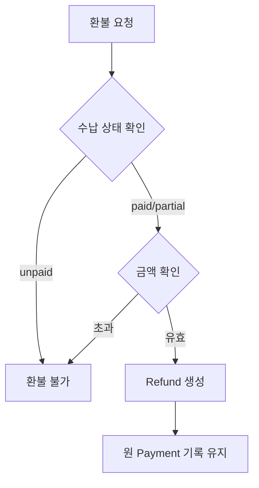

---

## 7. 상태 전이 다이어그램

### 7.1 StudentStatus
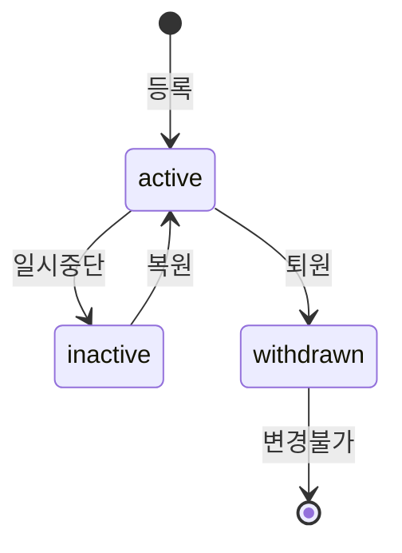

### 7.2 PaymentStatus
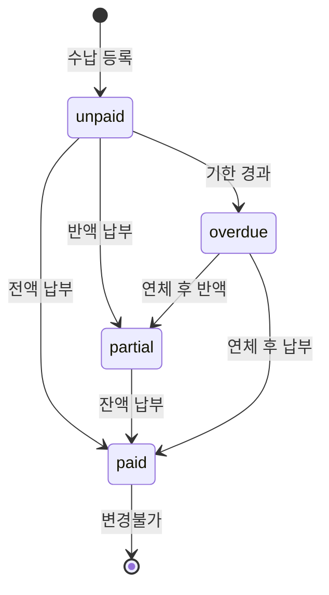

### 7.3 EnrollmentStatus
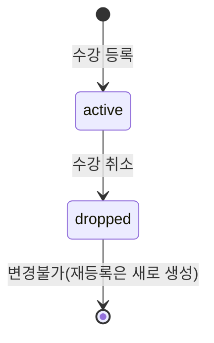

### 7.4 MakeupStatus
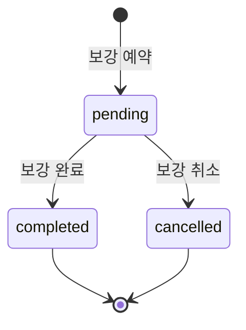

### 7.5 WaitlistStatus
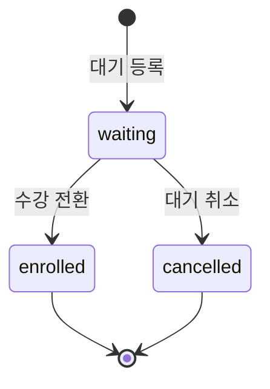

### 7.6 SalaryStatus
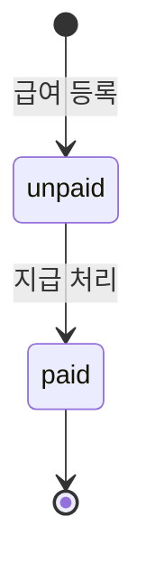

---

## 8. 비즈니스 규칙 (Validation & Constraints)

### 8.1 반 생성/수정
| 규칙 | 검증 시점 | 에러 코드 |
|------|----------|----------|
| 같은 강사 시간표 충돌 불가 | POST/PUT /api/classes | INSTRUCTOR_SCHEDULE_CONFLICT |
| 같은 교실 시간표 충돌 불가 | POST/PUT /api/classes | ROOM_SCHEDULE_CONFLICT |
| 정원은 1 이상 | POST/PUT /api/classes | INVALID_MAX_STUDENTS |
| 수강료는 0 이상 | POST/PUT /api/classes | INVALID_MONTHLY_FEE |

### 8.2 수강 등록
| 규칙 | 검증 시점 | 에러 코드 |
|------|----------|----------|
| 중복 등록 불가 | POST /api/enrollments | DUPLICATE_ENROLLMENT |
| withdrawn 학생 등록 불가 | POST /api/enrollments | STUDENT_WITHDRAWN |
| closed 반 등록 불가 | POST /api/enrollments | CLASS_CLOSED |
| 정원 초과 시 대기자 전환 | POST /api/enrollments | CLASS_FULL_WAITLISTED |
| 시간표 충돌 시 경고 | POST /api/enrollments | (warning) |

### 8.3 출석
| 규칙 | 검증 시점 | 에러 코드 |
|------|----------|----------|
| active enrollment만 출석 가능 | POST /api/attendance/bulk | INACTIVE_ENROLLMENT |
| 같은 날 중복 출석 불가 | POST /api/attendance/bulk | DUPLICATE_ATTENDANCE |
| 휴일 출석 불가 | POST /api/attendance/bulk | HOLIDAY_NOT_ALLOWED |

### 8.4 수납
| 규칙 | 검증 시점 | 에러 코드 |
|------|----------|----------|
| 같은 학생+반+월 중복 불가 | POST /api/payments | DUPLICATE_PAYMENT |
| 금액은 양수 | POST /api/payments | INVALID_AMOUNT |
| inactive 학생 수납 생성 불가 | POST /api/payments | STUDENT_INACTIVE |
| 부분 납부는 50%만 | PATCH /api/payments/[id]/pay | INVALID_PARTIAL_AMOUNT |

### 8.5 삭제 제약
| 대상 | 제약 조건 | 에러 코드 |
|------|----------|----------|
| Student | active enrollment 있으면 불가 | ACTIVE_ENROLLMENT_EXISTS |
| Instructor | active class 있으면 불가 | ACTIVE_CLASS_EXISTS |
| Class | active enrollment 있으면 불가 | ACTIVE_ENROLLMENT_EXISTS |

### 8.6 보강
| 규칙 | 검증 시점 | 에러 코드 |
|------|----------|----------|
| 같은 반의 다른 시간대만 | POST /api/makeup-classes | INVALID_MAKEUP_TIME |
| 결석 기록 필요 | POST /api/makeup-classes | NO_ABSENCE_RECORD |
| 휴일 보강 불가 | POST /api/makeup-classes | HOLIDAY_NOT_ALLOWED |

### 8.7 대기자
| 규칙 | 검증 시점 | 에러 코드 |
|------|----------|----------|
| 중복 대기 불가 | POST /api/waitlist | DUPLICATE_WAITLIST |
| 우선순위는 FIFO 자동 | POST /api/waitlist | - |
| 정원 여유 있어야 전환 | PATCH /api/waitlist/[id]/enroll | CLASS_STILL_FULL |

### 8.8 환불
| 규칙 | 검증 시점 | 에러 코드 |
|------|----------|----------|
| paid/partial만 환불 가능 | POST /api/refunds | INVALID_PAYMENT_STATUS |
| 환불액 ≤ 납부액 | POST /api/refunds | REFUND_AMOUNT_EXCEEDS |

### 8.9 급여
| 규칙 | 검증 시점 | 에러 코드 |
|------|----------|----------|
| 같은 강사+월 중복 불가 | POST /api/instructor-salaries | DUPLICATE_SALARY |
| 금액은 양수 | POST /api/instructor-salaries | INVALID_AMOUNT |

---

## 9. 에러 처리

### 9.1 HTTP 상태 코드
| 코드 | 의미 | 사용 사례 |
|------|------|----------|
| 200 | OK | 조회, 수정 성공 |
| 201 | Created | 생성 성공 |
| 400 | Bad Request | 유효성 검증 실패 |
| 404 | Not Found | 리소스 없음 |
| 409 | Conflict | 중복, 충돌 |
| 500 | Internal Server Error | 서버 오류 |

### 9.2 에러 응답 형식
```typescript
interface ErrorResponse {
  error: string;          // 사용자 친화적 메시지
  code: string;           // 에러 코드
  details?: any;          // 추가 정보 (충돌 목록 등)
}
```

### 9.3 에러 코드 목록
```typescript
const ERROR_CODES = {
  // Common
  NOT_FOUND: "리소스를 찾을 수 없습니다.",
  VALIDATION_ERROR: "입력 데이터가 유효하지 않습니다.",

  // Student
  STUDENT_WITHDRAWN: "퇴원한 수강생입니다.",
  STUDENT_INACTIVE: "일시중단 상태의 수강생입니다.",
  ACTIVE_ENROLLMENT_EXISTS: "활성 수강 중인 반이 있습니다.",

  // Instructor
  ACTIVE_CLASS_EXISTS: "담당 중인 반이 있습니다.",

  // Class
  INSTRUCTOR_SCHEDULE_CONFLICT: "강사 시간표가 충돌합니다.",
  ROOM_SCHEDULE_CONFLICT: "교실 시간표가 충돌합니다.",
  CLASS_CLOSED: "종료된 반입니다.",
  CLASS_FULL: "정원이 초과되었습니다.",
  CLASS_FULL_WAITLISTED: "정원 초과로 대기자 등록되었습니다.",
  CLASS_STILL_FULL: "아직 정원에 여유가 없습니다.",
  INVALID_MAX_STUDENTS: "정원은 1명 이상이어야 합니다.",
  INVALID_MONTHLY_FEE: "수강료는 0원 이상이어야 합니다.",

  // Enrollment
  DUPLICATE_ENROLLMENT: "이미 수강 등록되어 있습니다.",
  INACTIVE_ENROLLMENT: "활성 수강 상태가 아닙니다.",

  // Attendance
  DUPLICATE_ATTENDANCE: "이미 출석 체크되었습니다.",
  HOLIDAY_NOT_ALLOWED: "휴일에는 불가합니다.",

  // Payment
  DUPLICATE_PAYMENT: "이미 해당 월의 수납이 존재합니다.",
  INVALID_AMOUNT: "금액이 유효하지 않습니다.",
  INVALID_PARTIAL_AMOUNT: "부분 납부는 50%만 가능합니다.",
  INVALID_PAYMENT_STATUS: "납부되지 않은 건입니다.",

  // Refund
  REFUND_AMOUNT_EXCEEDS: "환불 금액이 납부 금액을 초과합니다.",

  // MakeupClass
  NO_ABSENCE_RECORD: "결석 기록이 없습니다.",
  INVALID_MAKEUP_TIME: "같은 반의 다른 시간대만 가능합니다.",

  // Waitlist
  DUPLICATE_WAITLIST: "이미 대기 등록되어 있습니다.",

  // Salary
  DUPLICATE_SALARY: "이미 해당 월의 급여가 등록되어 있습니다.",

  // Holiday
  DUPLICATE_HOLIDAY: "이미 등록된 휴일입니다.",
} as const;
```

---

## 10. 페이지 라우팅

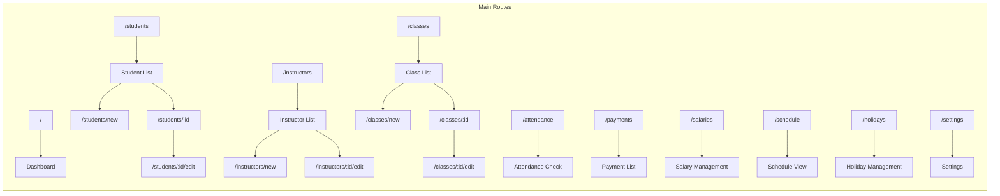

---

## 11. 상수 정의

```typescript
// 페이지네이션
export const PAGE_SIZE = 10;

// 수납 방법
export const PAYMENT_METHODS = ['cash', 'card', 'transfer'] as const;
export const PAYMENT_METHOD_LABELS = {
  cash: '현금',
  card: '카드',
  transfer: '계좌이체',
} as const;

// 부분 납부 비율
export const PARTIAL_PAYMENT_RATIO = 0.5;

// 대시보드 표시 건수
export const DASHBOARD_RECENT_COUNT = 5;
export const DASHBOARD_UNPAID_LIMIT = 10;

// 상태 레이블
export const STUDENT_STATUS_LABELS = {
  active: '수강중',
  inactive: '일시중단',
  withdrawn: '퇴원',
} as const;

export const PAYMENT_STATUS_LABELS = {
  paid: '납부완료',
  partial: '부분납부',
  unpaid: '미납',
  overdue: '연체',
} as const;

export const ATTENDANCE_STATUS_LABELS = {
  present: '출석',
  absent: '결석',
  late: '지각',
  excused: '사유결석',
} as const;

// 요일
export const DAY_OF_WEEK_LABELS = ['일', '월', '화', '수', '목', '금', '토'];

// 한국 공휴일 (2024-2026)
export const KOREAN_PUBLIC_HOLIDAYS = {
  2024: [
    { date: '2024-01-01', name: '신정' },
    { date: '2024-02-09', name: '설날 연휴' },
    { date: '2024-02-10', name: '설날' },
    { date: '2024-02-11', name: '설날 연휴' },
    { date: '2024-02-12', name: '대체공휴일' },
    { date: '2024-03-01', name: '삼일절' },
    { date: '2024-05-05', name: '어린이날' },
    { date: '2024-05-06', name: '대체공휴일' },
    { date: '2024-05-15', name: '부처님오신날' },
    { date: '2024-06-06', name: '현충일' },
    { date: '2024-08-15', name: '광복절' },
    { date: '2024-09-16', name: '추석 연휴' },
    { date: '2024-09-17', name: '추석' },
    { date: '2024-09-18', name: '추석 연휴' },
    { date: '2024-10-03', name: '개천절' },
    { date: '2024-10-09', name: '한글날' },
    { date: '2024-12-25', name: '성탄절' },
  ],
  2025: [
    { date: '2025-01-01', name: '신정' },
    { date: '2025-01-28', name: '설날 연휴' },
    { date: '2025-01-29', name: '설날' },
    { date: '2025-01-30', name: '설날 연휴' },
    { date: '2025-03-01', name: '삼일절' },
    { date: '2025-05-05', name: '어린이날' },
    { date: '2025-05-05', name: '부처님오신날' },
    { date: '2025-06-06', name: '현충일' },
    { date: '2025-08-15', name: '광복절' },
    { date: '2025-10-03', name: '개천절' },
    { date: '2025-10-05', name: '추석 연휴' },
    { date: '2025-10-06', name: '추석' },
    { date: '2025-10-07', name: '추석 연휴' },
    { date: '2025-10-08', name: '대체공휴일' },
    { date: '2025-10-09', name: '한글날' },
    { date: '2025-12-25', name: '성탄절' },
  ],
  2026: [
    { date: '2026-01-01', name: '신정' },
    { date: '2026-02-16', name: '설날 연휴' },
    { date: '2026-02-17', name: '설날' },
    { date: '2026-02-18', name: '설날 연휴' },
    { date: '2026-03-01', name: '삼일절' },
    { date: '2026-03-02', name: '대체공휴일' },
    { date: '2026-05-05', name: '어린이날' },
    { date: '2026-05-24', name: '부처님오신날' },
    { date: '2026-06-06', name: '현충일' },
    { date: '2026-08-15', name: '광복절' },
    { date: '2026-08-17', name: '대체공휴일' },
    { date: '2026-09-24', name: '추석 연휴' },
    { date: '2026-09-25', name: '추석' },
    { date: '2026-09-26', name: '추석 연휴' },
    { date: '2026-10-03', name: '개천절' },
    { date: '2026-10-05', name: '대체공휴일' },
    { date: '2026-10-09', name: '한글날' },
    { date: '2026-12-25', name: '성탄절' },
  ],
};
```

---

## 12. 파일 구조

```
src/
├── app/
│   ├── api/
│   │   ├── students/
│   │   │   ├── route.ts              # GET, POST
│   │   │   └── [id]/
│   │   │       └── route.ts          # GET, PUT, DELETE
│   │   ├── instructors/
│   │   │   ├── route.ts
│   │   │   └── [id]/
│   │   │       └── route.ts
│   │   ├── classes/
│   │   │   ├── route.ts
│   │   │   └── [id]/
│   │   │       └── route.ts
│   │   ├── enrollments/
│   │   │   ├── route.ts
│   │   │   ├── check-conflict/
│   │   │   │   └── route.ts
│   │   │   └── [id]/
│   │   │       └── drop/
│   │   │           └── route.ts
│   │   ├── attendance/
│   │   │   ├── route.ts
│   │   │   ├── bulk/
│   │   │   │   └── route.ts
│   │   │   ├── stats/
│   │   │   │   └── route.ts
│   │   │   └── [id]/
│   │   │       └── route.ts
│   │   ├── payments/
│   │   │   ├── route.ts
│   │   │   ├── unpaid/
│   │   │   │   └── route.ts
│   │   │   ├── calculate-prorated/
│   │   │   │   └── route.ts
│   │   │   └── [id]/
│   │   │       ├── route.ts
│   │   │       └── pay/
│   │   │           └── route.ts
│   │   ├── refunds/
│   │   │   └── route.ts
│   │   ├── consultations/
│   │   │   ├── route.ts
│   │   │   └── [id]/
│   │   │       └── route.ts
│   │   ├── makeup-classes/
│   │   │   ├── route.ts
│   │   │   └── [id]/
│   │   │       └── route.ts
│   │   ├── waitlist/
│   │   │   ├── route.ts
│   │   │   └── [id]/
│   │   │       ├── route.ts
│   │   │       └── enroll/
│   │   │           └── route.ts
│   │   ├── instructor-salaries/
│   │   │   ├── route.ts
│   │   │   ├── stats/
│   │   │   │   └── route.ts
│   │   │   └── [id]/
│   │   │       └── pay/
│   │   │           └── route.ts
│   │   ├── holidays/
│   │   │   ├── route.ts
│   │   │   ├── init-public/
│   │   │   │   └── route.ts
│   │   │   └── [id]/
│   │   │       └── route.ts
│   │   ├── dashboard/
│   │   │   └── route.ts
│   │   ├── schedule/
│   │   │   ├── weekly/
│   │   │   │   └── route.ts
│   │   │   └── monthly/
│   │   │       └── route.ts
│   │   ├── settings/
│   │   │   └── route.ts
│   │   ├── search/
│   │   │   └── route.ts
│   │   ├── export/
│   │   │   ├── students/
│   │   │   │   └── route.ts
│   │   │   ├── payments/
│   │   │   │   └── route.ts
│   │   │   └── attendance/
│   │   │       └── route.ts
│   │   └── backup/
│   │       └── route.ts
│   ├── (routes)/
│   │   ├── page.tsx                  # Dashboard
│   │   ├── students/
│   │   ├── instructors/
│   │   ├── classes/
│   │   ├── attendance/
│   │   ├── payments/
│   │   ├── salaries/
│   │   ├── schedule/
│   │   ├── holidays/
│   │   └── settings/
│   └── layout.tsx
├── components/
├── lib/
│   ├── storage.ts
│   ├── utils.ts
│   └── constants.ts
├── types/
│   └── index.ts
└── hooks/
data/
└── db.json
```
